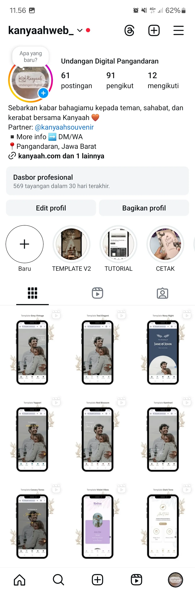

Beberapa hari belakangan ini, saya cukup intens update konten di akun Instagram Kanyaah [@kanyaahweb_](https://instagram.com/kanyaahweb_).

Saya sadar beberapa hal:
1. Kebanyakan potential customer lihat Instagram dulu sebelum mengunjungi website. Ini terbukti dari adanya yang bertanya terkait harga suatu template ke WhatsApp Kanyaah, yang merujuk ke salah satu story yang disimpan di sorotan.
2. Konten Instagram Kanyaah udah lama sekali nggak di-update. Udah cukup banyak yang berubah dari versi WordPress. Saya khawatir potensial customer kebingungan karena konten di Instagram nggak sesuai dengan yang ada di website.

Makanya saya memutuskan buat nambahin beberapa konten di Instagram Kanyaah.

Konten pertama adalah konten proses membagikan undangan dan install aplikasi. Masih cukup banyak yang bertanya cara menyebarkan undangan di Kanyaah. Padahal, saya udah saya buatkan fiturnya.

Konten install aplikasi sebenarnya sudah saya buat berupa carousel. Hanya saja saya merasa bahwa konten video lebih interaktif, jadinya saya remake aja.

Konten selanjutnya adalah konten template yang tersedia. Sejauh ini sudah ada 10 template yang siap digunakan.

Per hari ini sudah semua template saya tambahkan di Reels dan di Story. Saya tambahkan juga ke sorotan untuk memudahkan potential user mencari apa yang mereka perlukan.

Setelah konten konten esensial selesai diupload rencananya saya akan menambahkan satu-dua template baru sebelum benar-benar fokus ke marketing. Saya juga sepertinya akan buat akun Kanyaah di TikTok untuk promosi.

Bismillah, semoga konsisten 💪

