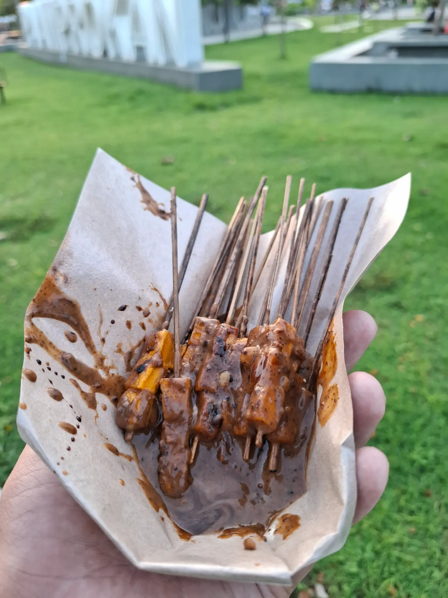

Kalau kalian lagi liburan ke Pangandaran, kalian wajib cobain makan sate aci.

Sate aci adalah sate yang bahan dasarnya adalah tepung tapioka. Ya, kalian nggak salah kok. Bahan bakunya mirip dengan cilok atau makanan per-aci-an khas lainnya dari Jawa Barat. Hanya saja, penyajiannya cukup unik, yaitu dibakar.

Saya pertama kali makan ini pas awal-awal nikah. Awal beli sih heran, ini aci kok dibikin sate. Tapi pas cobain, wah, rasanya enak banget!

Satenya ini warna kekuningan, entahlah mungkin pakai kunyit atau semacamnya sebagai rempah-rempah. Bentuknya kotak-kotak, seperti dipotong kecil-kecil pakai pisau pemotong. Ada tiga potong aci di setiap tusuk sate. Teksturnya ya kayak makanan per-aci-an pada umumnya: kenyal. Tapi, tekstur kenyal ini yang bikin seolah-olah mirip dengan daging asli.

Setelah dibakar, warna acinya akan sedikit berubah jadi kuning muda. Ketika digigit, tekstur kenyal dan sedikit mengerasnya itu khas banget.

Yang bikin enaknya adalah bumbu sate acinya. Bumbunya sebenarnya sama dengan bumbu sate pada umumnya, tapi kalau dikombinasikan dengan tekstur sate aci yang khas, rasanya, beuh, jadi enak banget!

Selain enak, karena bahan bakunya cuma aci, harga satu tusuknya pun cuma 500 rupiah. Jadi, beli 5000 aja udah dapet 10 tusuk. Karena satu tusuknya cuma ada 3 potong aci, saya biasanya beli 10.000. Biar dapet agak banyak karena seringnya dimakan bareng-bareng sama anak istri 😄.

Oiya, pedagang sate aci ini biasanya naik sepeda atau motor ya. Biasanya sering jualan sore hari di Alun-alun Paamprokan. Selain di Paamprokan, biasanya pedagang sate aci ini sering jualan di daerah bunderan dekat pintu masuk pantai Pangandaran via Cikembulan Pass. Kadang juga jualan di daerah pantai Batuhiu, atau sekadar melintas di jalan utama Parigi-Pangandaran.

Gimana? Tertarik nyoba makan sate aci?

*Ini aslinya 20 tusuk, tapi sebagian udah saya makan, haha*