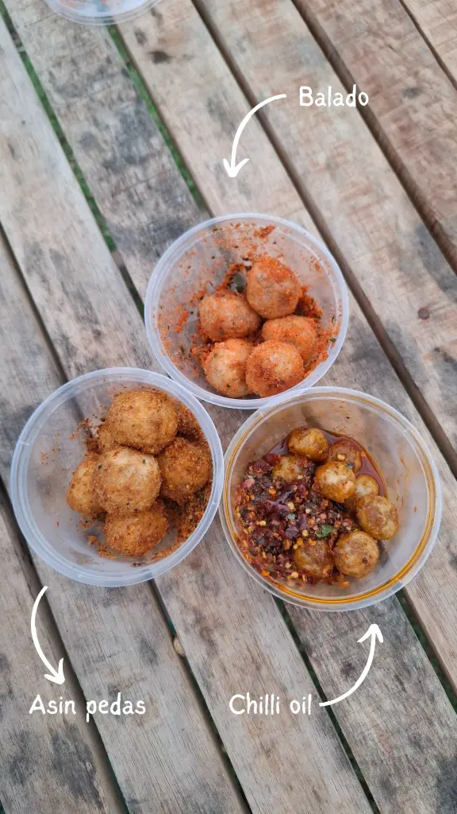
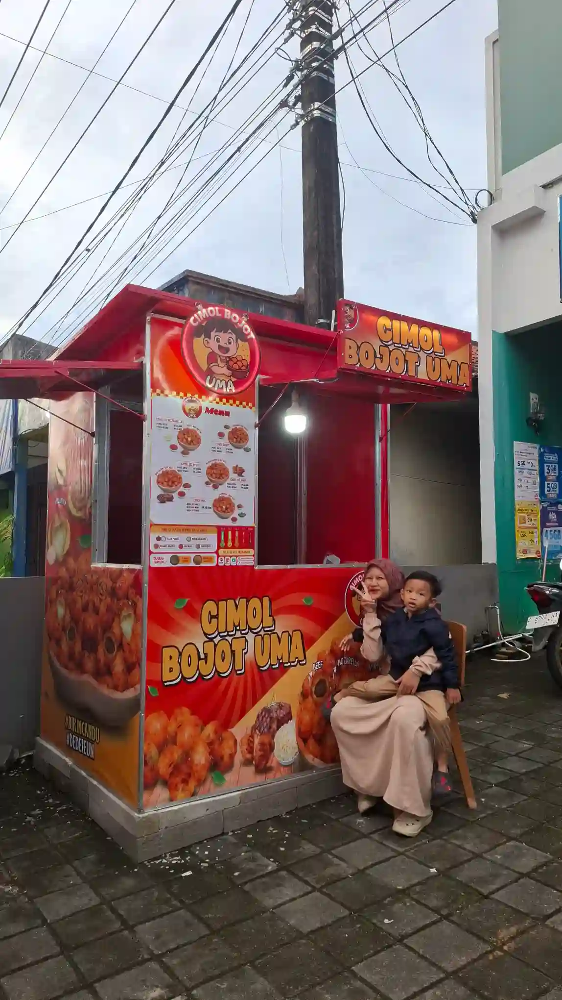

Sore ini, selepas saya kerja, kami jalan-jalan sore. Udah beberapa hari ini hujan turun seharian. Hari ini hujan reda dan cukup cerah, jadi kami manfaatkan sebisa mungkin untuk menikmati suasana sore.

Agenda jalan-jalan sore kami tiada lain tiada bukan adalah kulineran, haha. Tujuan kami adalah Cimol Bojot Uma yang terletak di sebrang Koramil Pangandaran, tepatnya di depan salah satu gerai smartphone, bersebelahan dengan outlet layanan tarik dan setor tunai salah satu bank.

Kami memesan 3 menu: balado, asin pedas, dan chili oil. Tentu saja, saya makan cimol bojot asin pedas dan chili oil lebih banyak, mengingat istri lagi dalam masa pemulihan asam lambung

Harga per porsinya mulai dari Rp8.000 aja. Ada porsi kecil dan porsi besar.

Bumbu yang tersedia juga ada 5 macam, yaitu balado, asin pedas, ayam bawang, jagung bakar, dan barbeque.

Varian cimol nya ada 3: cimol tanpa isi, cimol isi daging ayam, cimol isi beef, dan cimol isi mozarella.

Di Pangandaran, per saya nulis ini, sudah ada tiga outlet Cimol Bojot Uma yang tersedia. Satu di Alun-alun Paamprokan. Biasanya buka sore hari sekitar jam setengah 5 sore. Satu lagi di kawasan kios mitra UMKM Indomaret perempatan Cikembulan yang akan menuju ke arah Cikembulan Pass. Satu lagi, ya yang saya kunjungi ini.

Kata istri di Parigi juga ternyata ada satu outlet lagi, dekat Pusat Gadai Indonesia. Saya belum lihat langsung untuk outlet yang satu ini.

Jadi, buat temen-temen warga asli Pangandaran, atau lagi main ke Pangandaran, jangan lupa jajan Cimol Bojot Uma. Bumbunya enak, gurih, dan bikin nagih, hihi.

*Lagi nunggu pesanan siap, hehe*